# Motion Diagram Studio

[中文](README.md) · **English**

Turn architecture and workflows into animated diagrams, interactive HTML and MP4 videos.

Built on [live-panel-skill](https://github.com/ythx-101/live-panel-skill), Motion Diagram Studio turns JSON configurations into animated diagrams, interactive web pages and MP4 videos. It includes eight original Chinese demos, four color schemes, animated avatars and individual block exports.

Independently extended and maintained by @sycbruce; not an official upstream project. Formerly named Live Panel Studio.

Maintainer and contact: **[@sycbruce on X](https://x.com/sycbruce)** · [Report an issue](https://github.com/cwybruce/motion-diagram-studio/issues)

**[Live website and video library](https://cwybruce.github.io/motion-diagram-studio/)** · [Interactive demo gallery](https://cwybruce.github.io/motion-diagram-studio/examples/capability-demos/index.html) · [Block export examples](https://cwybruce.github.io/motion-diagram-studio/#exports)

The website plays all eight demos in four color schemes, the initial recreation and the spider update. It also presents 39 block videos and three light-theme robot export examples. Playback, seeking and MP4 downloads work online; run the local service below to render a new configuration. The demos and gallery currently use Chinese; this README is available in both languages.

## Animated demos

These looping previews show the first **six seconds** of the actual exported MP4s. **Click a preview to watch the full video** at its original quality and frame rate. More scenes, avatars and blocks are available in the [online video library](https://cwybruce.github.io/motion-diagram-studio/).

| RAG evidence walkthrough · Warm Ink | RAG evidence walkthrough · Warm Paper |
| --- | --- |
| [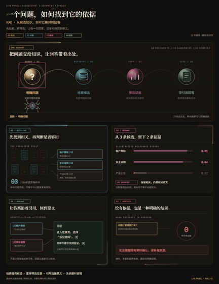](https://cwybruce.github.io/motion-diagram-studio/examples/capability-demos/rag-explainer/demo.mp4) | [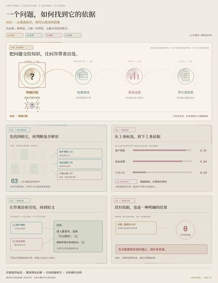](https://cwybruce.github.io/motion-diagram-studio/examples/capability-demos/rag-explainer/demo-light.mp4) |
| [▶ Full MP4 · 12 seconds](https://cwybruce.github.io/motion-diagram-studio/examples/capability-demos/rag-explainer/demo.mp4) | [▶ Full MP4 · 12 seconds](https://cwybruce.github.io/motion-diagram-studio/examples/capability-demos/rag-explainer/demo-light.mp4) |

| RAG evidence walkthrough · Classic Terminal | RAG evidence walkthrough · Classic Pastel |
| --- | --- |
| [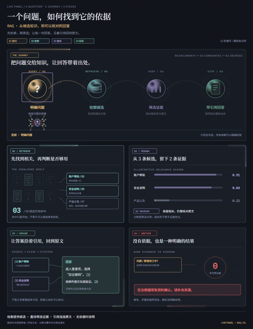](https://cwybruce.github.io/motion-diagram-studio/examples/capability-demos/rag-explainer/demo-terminal.mp4) | [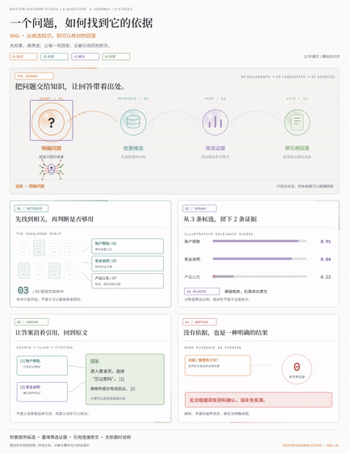](https://cwybruce.github.io/motion-diagram-studio/examples/capability-demos/rag-explainer/demo-pastel.mp4) |
| [▶ Full MP4 · 12 seconds](https://cwybruce.github.io/motion-diagram-studio/examples/capability-demos/rag-explainer/demo-terminal.mp4) | [▶ Full MP4 · 12 seconds](https://cwybruce.github.io/motion-diagram-studio/examples/capability-demos/rag-explainer/demo-pastel.mp4) |

## What it does

- **Eight original Chinese demos:** RAG evidence walkthrough, multi-agent handoffs, requests and caching, knowledge cards, ticket workflows, incident recovery, vector components and avatar navigation.
- **Four color schemes:** Warm Ink, Warm Paper, Classic Terminal and Classic Pastel. Each uses a 984 × 1280 portrait layout with embedded Chinese fonts and animated neon edges, trails and local glows around functional blocks.
- **Interactive playback:** pause, replay, seek, jump to key moments and play at 0.5 / 1 / 2× speed. Scenes with avatars support switching between a spider and a robot.
- **Independent MP4 exports:** export a complete demo or one of its internal blocks, with **39 named regions** in total. Each export renders a new file using the selected theme, avatar and scope.
- **Deterministic playback:** animation is driven by `window.seek(t)`. Browser previews and frame-by-frame video rendering share the same timeline.
- **Editable JSON and SVG:** change text, data, colors and timelines, extend components or design your own scenes.

All demo events, metrics, logs and data are **scripted simulations**. They do not connect to live agents, databases or business services. Default demo videos are **12 seconds at 30 fps, encoded as H.264 MP4 with a silent AAC audio track**.

## Four color schemes

Warm Ink and Warm Paper preserve this project's existing visual style. Classic Terminal and Classic Pastel follow the color directions of the upstream Codex Agent diagram and AI Agent architecture diagram, respectively, and apply them to all eight original scenes.

| Scheme | Theme ID | Style and live preview |
| --- | --- | --- |
| Warm Ink | `terminal-dark` | Warm dark background with gold and orange accents; [open RAG](https://cwybruce.github.io/motion-diagram-studio/examples/capability-demos/index.html?theme=terminal-dark#rag-explainer) |
| Warm Paper | `light-pastel` | Off-white paper background with soft, warm colors; [open RAG](https://cwybruce.github.io/motion-diagram-studio/examples/capability-demos/index.html?theme=light-pastel#rag-explainer) |
| Classic Terminal | `terminal-classic` | Cool charcoal background with cyan, blue, green and purple accents; [open RAG](https://cwybruce.github.io/motion-diagram-studio/examples/capability-demos/index.html?theme=terminal-classic#rag-explainer) |
| Classic Pastel | `pastel-classic` | White background with blue, yellow, orange, purple and red sections; [open RAG](https://cwybruce.github.io/motion-diagram-studio/examples/capability-demos/index.html?theme=pastel-classic#rag-explainer) |

Theme and avatar are selected independently. Complete-demo and block exports both use the selected scheme. The new schemes preserve existing theme IDs and video filenames.

## Quick start

The currently tested environment is **Windows, Python 3.11, system Chrome and FFmpeg**. The renderer can also detect an installed Edge browser. Python 3.11 or later is recommended. Upstream Linux and macOS rendering paths remain available; the complete export workflow added by this project has not yet been tested on those platforms.

Install these prerequisites:

1. [Python](https://www.python.org/downloads/) 3.11 or later.
2. [Chrome](https://www.google.com/chrome/) or [Edge](https://www.microsoft.com/edge). The system browser is used; downloading Playwright Chromium is unnecessary.
3. [FFmpeg](https://ffmpeg.org/download.html). Add the directory containing `ffmpeg` and `ffprobe` to your `PATH`.

Run in a terminal:

```powershell
git clone https://github.com/cwybruce/motion-diagram-studio.git
cd motion-diagram-studio
python -m pip install -r requirements-windows.txt
python scripts/make_capability_demos.py
python scripts/preview_server.py --port 8779
```

Open **[http://127.0.0.1:8779/index.html](http://127.0.0.1:8779/index.html)**. Select a demo, theme, avatar and export scope, then click “导出当前方案” (Export current configuration). The service listens only on localhost and saves generated files in `examples/capability-demos/exports/`.

Generated standalone HTML files can be opened offline or deployed to a static website. **Interactive animation works when viewing an HTML file or a statically hosted website; rendering a new MP4 requires the local Python preview service above.** Existing videos can be downloaded directly.

## Examples and exports

| Demo | Scenario | Full videos |
| --- | --- | --- |
| [RAG evidence walkthrough](examples/capability-demos/rag-explainer/README.md) | Retrieval, scoring, reranking, citations and answer flow | [Warm Ink](https://cwybruce.github.io/motion-diagram-studio/examples/capability-demos/rag-explainer/demo.mp4) · [Warm Paper](https://cwybruce.github.io/motion-diagram-studio/examples/capability-demos/rag-explainer/demo-light.mp4) · [Classic Terminal](https://cwybruce.github.io/motion-diagram-studio/examples/capability-demos/rag-explainer/demo-terminal.mp4) · [Classic Pastel](https://cwybruce.github.io/motion-diagram-studio/examples/capability-demos/rag-explainer/demo-pastel.mp4) |
| [Multi-agent handoffs](examples/capability-demos/agent-team/README.md) | Task tree, time lanes, handoff packages and status changes | [Warm Ink](https://cwybruce.github.io/motion-diagram-studio/examples/capability-demos/agent-team/demo.mp4) · [Warm Paper](https://cwybruce.github.io/motion-diagram-studio/examples/capability-demos/agent-team/demo-light.mp4) · [Classic Terminal](https://cwybruce.github.io/motion-diagram-studio/examples/capability-demos/agent-team/demo-terminal.mp4) · [Classic Pastel](https://cwybruce.github.io/motion-diagram-studio/examples/capability-demos/agent-team/demo-pastel.mp4) |
| [Requests and cache branches](examples/capability-demos/product-request/README.md) | Request paths, cache hits, origin fetches and merges | [Warm Ink](https://cwybruce.github.io/motion-diagram-studio/examples/capability-demos/product-request/demo.mp4) · [Warm Paper](https://cwybruce.github.io/motion-diagram-studio/examples/capability-demos/product-request/demo-light.mp4) · [Classic Terminal](https://cwybruce.github.io/motion-diagram-studio/examples/capability-demos/product-request/demo-terminal.mp4) · [Classic Pastel](https://cwybruce.github.io/motion-diagram-studio/examples/capability-demos/product-request/demo-pastel.mp4) |
| [Short-video knowledge cards](examples/capability-demos/knowledge-card/README.md) | Chapter rotation, source checks and review maps | [Warm Ink](https://cwybruce.github.io/motion-diagram-studio/examples/capability-demos/knowledge-card/demo.mp4) · [Warm Paper](https://cwybruce.github.io/motion-diagram-studio/examples/capability-demos/knowledge-card/demo-light.mp4) · [Classic Terminal](https://cwybruce.github.io/motion-diagram-studio/examples/capability-demos/knowledge-card/demo-terminal.mp4) · [Classic Pastel](https://cwybruce.github.io/motion-diagram-studio/examples/capability-demos/knowledge-card/demo-pastel.mp4) |
| [Business ticket workflows](examples/capability-demos/business-workflow/README.md) | Four-stage board, ticket routing, review and retries | [Warm Ink](https://cwybruce.github.io/motion-diagram-studio/examples/capability-demos/business-workflow/demo.mp4) · [Warm Paper](https://cwybruce.github.io/motion-diagram-studio/examples/capability-demos/business-workflow/demo-light.mp4) · [Classic Terminal](https://cwybruce.github.io/motion-diagram-studio/examples/capability-demos/business-workflow/demo-terminal.mp4) · [Classic Pastel](https://cwybruce.github.io/motion-diagram-studio/examples/capability-demos/business-workflow/demo-pastel.mp4) |
| [Incident and recovery replay](examples/capability-demos/incident-replay/README.md) | Capacity curves, thresholds, exception paths and recovery checks | [Warm Ink](https://cwybruce.github.io/motion-diagram-studio/examples/capability-demos/incident-replay/demo.mp4) · [Warm Paper](https://cwybruce.github.io/motion-diagram-studio/examples/capability-demos/incident-replay/demo-light.mp4) · [Classic Terminal](https://cwybruce.github.io/motion-diagram-studio/examples/capability-demos/incident-replay/demo-terminal.mp4) · [Classic Pastel](https://cwybruce.github.io/motion-diagram-studio/examples/capability-demos/incident-replay/demo-pastel.mp4) |
| [Vector component lab](examples/capability-demos/component-lab/README.md) | Orbs, seats, rings, flowing ribbons, boards and figures | [Warm Ink](https://cwybruce.github.io/motion-diagram-studio/examples/capability-demos/component-lab/demo.mp4) · [Warm Paper](https://cwybruce.github.io/motion-diagram-studio/examples/capability-demos/component-lab/demo-light.mp4) · [Classic Terminal](https://cwybruce.github.io/motion-diagram-studio/examples/capability-demos/component-lab/demo-terminal.mp4) · [Classic Pastel](https://cwybruce.github.io/motion-diagram-studio/examples/capability-demos/component-lab/demo-pastel.mp4) |
| [Avatar navigation and themes](examples/capability-demos/avatar-themes/README.md) | Spider / robot avatars, path motion, target frames and keyword cues | [Warm Ink](https://cwybruce.github.io/motion-diagram-studio/examples/capability-demos/avatar-themes/demo.mp4) · [Warm Paper](https://cwybruce.github.io/motion-diagram-studio/examples/capability-demos/avatar-themes/demo-light.mp4) · [Classic Terminal](https://cwybruce.github.io/motion-diagram-studio/examples/capability-demos/avatar-themes/demo-terminal.mp4) · [Classic Pastel](https://cwybruce.github.io/motion-diagram-studio/examples/capability-demos/avatar-themes/demo-pastel.mp4) |

<details>
<summary>Expand animated previews of the other seven demos</summary>

### Multi-agent handoffs

[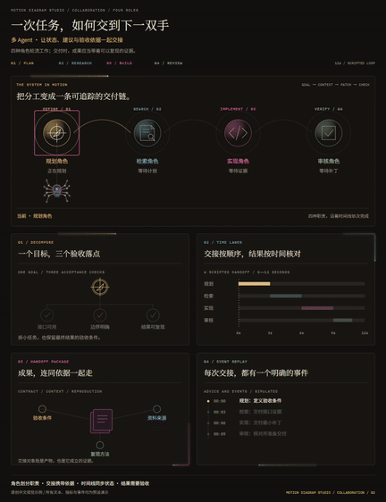](https://cwybruce.github.io/motion-diagram-studio/examples/capability-demos/agent-team/demo.mp4)

[▶ Full MP4](https://cwybruce.github.io/motion-diagram-studio/examples/capability-demos/agent-team/demo.mp4) · [Interactive demo](https://cwybruce.github.io/motion-diagram-studio/examples/capability-demos/index.html#agent-team)

### Requests and cache branches

[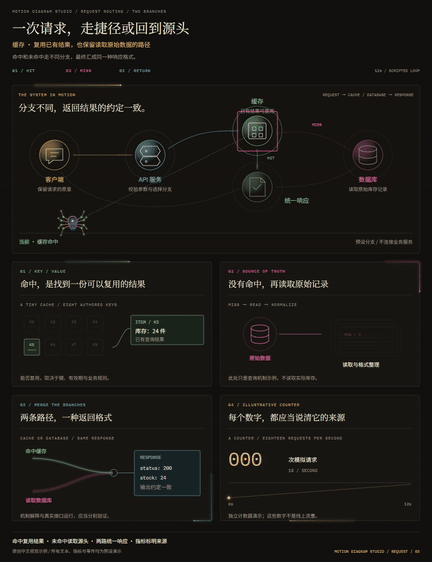](https://cwybruce.github.io/motion-diagram-studio/examples/capability-demos/product-request/demo.mp4)

[▶ Full MP4](https://cwybruce.github.io/motion-diagram-studio/examples/capability-demos/product-request/demo.mp4) · [Interactive demo](https://cwybruce.github.io/motion-diagram-studio/examples/capability-demos/index.html#product-request)

### Short-video knowledge cards

[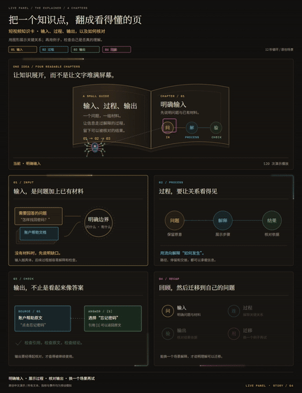](https://cwybruce.github.io/motion-diagram-studio/examples/capability-demos/knowledge-card/demo.mp4)

[▶ Full MP4](https://cwybruce.github.io/motion-diagram-studio/examples/capability-demos/knowledge-card/demo.mp4) · [Interactive demo](https://cwybruce.github.io/motion-diagram-studio/examples/capability-demos/index.html#knowledge-card)

### Business ticket workflows

[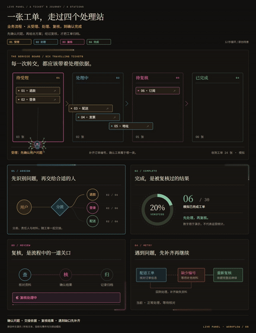](https://cwybruce.github.io/motion-diagram-studio/examples/capability-demos/business-workflow/demo.mp4)

[▶ Full MP4](https://cwybruce.github.io/motion-diagram-studio/examples/capability-demos/business-workflow/demo.mp4) · [Interactive demo](https://cwybruce.github.io/motion-diagram-studio/examples/capability-demos/index.html#business-workflow)

### Incident and recovery replay

[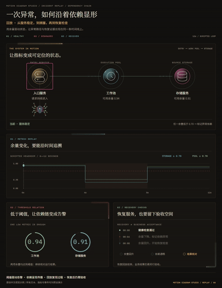](https://cwybruce.github.io/motion-diagram-studio/examples/capability-demos/incident-replay/demo.mp4)

[▶ Full MP4](https://cwybruce.github.io/motion-diagram-studio/examples/capability-demos/incident-replay/demo.mp4) · [Interactive demo](https://cwybruce.github.io/motion-diagram-studio/examples/capability-demos/index.html#incident-replay)

### Vector component lab

[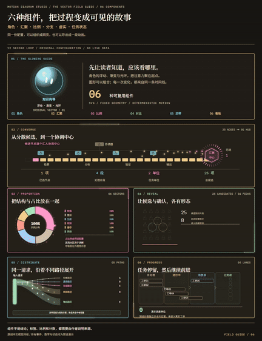](https://cwybruce.github.io/motion-diagram-studio/examples/capability-demos/component-lab/demo.mp4)

[▶ Full MP4](https://cwybruce.github.io/motion-diagram-studio/examples/capability-demos/component-lab/demo.mp4) · [Interactive demo](https://cwybruce.github.io/motion-diagram-studio/examples/capability-demos/index.html#component-lab)

### Avatar navigation and themes

[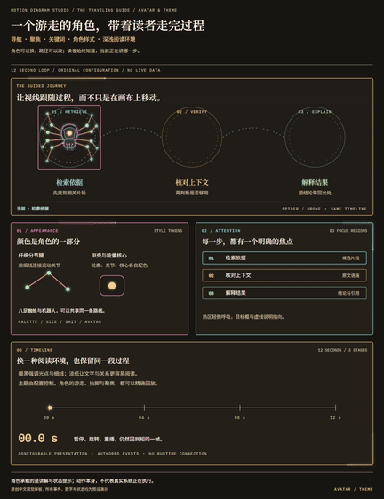](https://cwybruce.github.io/motion-diagram-studio/examples/capability-demos/avatar-themes/demo.mp4)

[▶ Full MP4](https://cwybruce.github.io/motion-diagram-studio/examples/capability-demos/avatar-themes/demo.mp4) · [Interactive demo](https://cwybruce.github.io/motion-diagram-studio/examples/capability-demos/index.html#avatar-themes)

</details>

<details>
<summary>Reference recreations: initial full video and spider update</summary>

These animations come from videos reimplemented and rendered by this project. Rights to the reference designs, layouts and wording remain with their original authors. Business figures are used only for visual demonstration; see the [third-party notices](THIRD_PARTY_NOTICES.md) for sources and scope.

| Initial full video · 71 seconds | Spider update · 12 seconds |
| --- | --- |
| [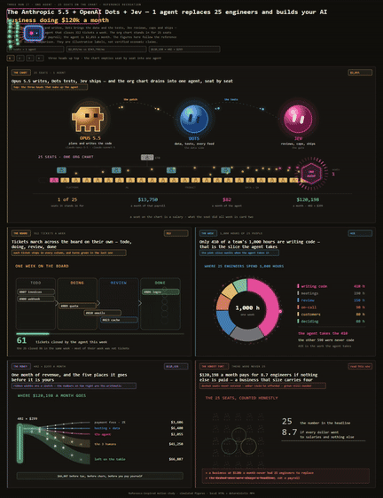](https://cwybruce.github.io/motion-diagram-studio/media/recreations/first-recreation.mp4) | [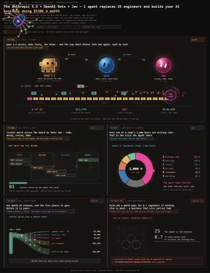](https://cwybruce.github.io/motion-diagram-studio/media/recreations/spider-recreation.mp4) |
| [▶ Full MP4](https://cwybruce.github.io/motion-diagram-studio/media/recreations/first-recreation.mp4) | [▶ Full MP4](https://cwybruce.github.io/motion-diagram-studio/media/recreations/spider-recreation.mp4) |

</details>

### Individual block videos

The RAG reranking evidence region, using Warm Paper and the robot configuration. Click the preview to watch the complete **478 × 324, 12-second MP4**.

[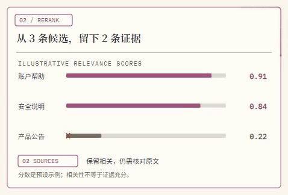](https://cwybruce.github.io/motion-diagram-studio/media/exports/robot/rag-rerank-light-drone.mp4)

[▶ Full block MP4](https://cwybruce.github.io/motion-diagram-studio/media/exports/robot/rag-rerank-light-drone.mp4) · [Browse all 39 blocks and export examples](https://cwybruce.github.io/motion-diagram-studio/#exports)

Each demo directory contains JSON configurations, standalone HTML, MP4s, PNG posters and documentation for all four color schemes. Warm Ink provides `config-dark.json` / `live-dark.html`, plus the default `config.json` / `live.html` entry points; its video and poster are `demo.mp4` / `poster.png`. Warm Paper uses the `-light` suffix, Classic Terminal uses `-terminal`, and Classic Pastel uses `-pastel`. See the [demo gallery guide](examples/capability-demos/README.md) for details.

Regenerate videos in all four color schemes:

```powershell
python scripts/make_capability_demos.py --render --themes all --jobs 2
```

To generate only the original Warm Ink and Warm Paper pair, `--themes both` remains available.

Export a complete demo or an individual block from the command line:

```powershell
# Complete demo: RAG, light theme, robot
python scripts/export_demo.py --scene rag-explainer --theme light-pastel --avatar drone --view full --out examples/capability-demos/exports/rag-light.mp4

# Individual block: RAG reranking region
python scripts/export_demo.py --scene rag-explainer --theme light-pastel --avatar drone --view rag-rerank --out examples/capability-demos/exports/rag-rerank-light.mp4

# Classic Terminal: complete multi-agent demo
python scripts/export_demo.py --scene agent-team --theme terminal-classic --avatar spider --view full --out examples/capability-demos/exports/agent-terminal.mp4

# Classic Pastel: RAG reranking block
python scripts/export_demo.py --scene rag-explainer --theme pastel-classic --avatar drone --view rag-rerank --out examples/capability-demos/exports/rag-rerank-pastel.mp4
```

Blocks are cropped to their actual canvas region while preserving their internal animation, text and edge glow. Available scene and region IDs are recorded in [`manifest.json`](examples/capability-demos/manifest.json). Exporting a current configuration preserves the original configurations and videos.

## Create your own scene

Copy an example configuration, edit its text, data, colors and layout, then render it:

```powershell
python scripts/render.py --config my-config.json --out my-video.mp4 --html-out my-page.html
python scripts/check_frames.py --config my-config.json --out-dir my-frames --repeat
```

- [`references/config-schema.md`](references/config-schema.md): elements, state machines, themes, avatars and `effects.neon` parameters.
- [`references/motion-grammar.md`](references/motion-grammar.md): path particles, state transitions and timeline motion.
- `scripts/rag_editorial.py`, `editorial_systems.py`, `editorial_stories.py` and `editorial_components.py`: configuration and narrative data for the eight demos.
- `assets/*editorial*.js`, `components.js` and `neon-flow.js`: SVG drawing, components, avatars and animated light effects.
- [`SKILL.md`](SKILL.md): the original upstream workflow for coding agents.

If you edit generated JSON directly, export it with `render.py`. Running `make_capability_demos.py` again rebuilds configurations from the generator. Coordinates are canvas pixels; changing the aspect ratio requires a new layout. `render.py --width / --height` scales the output only.

Chinese font subsets are embedded, so the existing scenes work without internet access or installed fonts. After adding new Chinese characters, rebuild the subsets if consistent typography across devices is required. Instructions and original font sources are in [`assets/fonts/README.md`](assets/fonts/README.md).

## Verification

```powershell
python -m unittest discover -s tests -v
python scripts/verify_capability_demos.py
python scripts/verify_demo_exports.py
```

Browser and export checks require a system browser, FFmpeg and `ffprobe`. Full checks render and decode videos, producing `verification.json` and `export-verification.json` in the demo gallery directory. These local reports are not published with the source. Use the results from your own environment.

## Sources, licenses and acknowledgments

This project is based on [ythx-101/live-panel-skill](https://github.com/ythx-101/live-panel-skill), starting from upstream commit [`8a70aa2`](https://github.com/ythx-101/live-panel-skill/commit/8a70aa2c4e3fac68b40e2472407e32e2637a7a36). The upstream **MIT License** and copyright notice are retained. Additions include the demo gallery, original Chinese scenes, SVG components, avatars, four color schemes and local block exports.

Upstream inspiration and retained examples have their own sources:

- [@thedelost](https://x.com/thedelost)'s [animated Codex Agent architecture diagram](https://x.com/thedelost/status/2105398038026195279), shared by [@slashui](https://x.com/slashui/status/2105850132365443528). `examples/codex-agents/` recreates its visuals; the design belongs to the original author.
- `examples/agent-architecture/` recreates the static infographic “AI Agent 的完整架构” (The Complete Architecture of an AI Agent) by **@林纾 on Xiaohongshu**. Its design, wording and colors belong to the original author.
- `examples/airbnb/` uses figures reported by an Airbnb executive in a [Latent.Space interview](https://www.latent.space/p/airbnb). Animated counters are for demonstration.
- Noto Serif SC, Noto Sans SC and IBM Plex Mono fonts use **SIL OFL 1.1**. Their licenses and renamed-subset documentation remain in the repository.

The MIT License covers the code; it does not relicense these third-party visual designs, text, data or fonts under MIT. See [`THIRD_PARTY_NOTICES.md`](THIRD_PARTY_NOTICES.md) and [`LICENSE`](LICENSE) for provenance and license boundaries. The reference video and frames provided by the user are not published. The video library's recreations were generated by this project, preserve the original authors' rights to their reference designs, and are listed separately from the eight original scenes.

## Static website and video library maintenance

The repository's root `index.html`, `assets/showcase.css` and `assets/showcase.js` form the static homepage. The eight demos use `examples/capability-demos/manifest.json`; recreations and export examples use [`media/catalog.json`](media/catalog.json). Videos are actual MP4s stored in the repository and use the browser's native player. Full videos are not preloaded by default, and starting one pauses other videos.

The site publishes the root directory of `main` through GitHub Pages and uses `.nojekyll` to preserve static files. See [GitHub's official documentation](https://docs.github.com/en/pages/getting-started-with-github-pages/configuring-a-publishing-source-for-your-github-pages-site) for publishing-source configuration. Push homepage, catalog or media updates to `main` to redeploy.

The README shows GIF excerpts generated from the rendered videos and links to the complete MP4s. GIFs and source videos are saved in the repository for maintenance. After updating videos, run `python scripts/make_readme_previews.py` to regenerate the previews in `assets/readme/`; FFmpeg is required.

The 39 light-theme spider block videos in `media/exports/` are cropped from their corresponding complete videos. Three additional examples—complete demo, main flow and reranking region—are rendered frame by frame with the light-theme robot configuration. The video library labels both methods. The website plays and downloads existing videos; the interactive gallery lets you adjust themes, avatars and the timeline. Static Pages does not run the Python renderer, so new MP4s require the local service.

Issues, scene improvements and component contributions are welcome. Project contact: **[X / @sycbruce](https://x.com/sycbruce)**.
