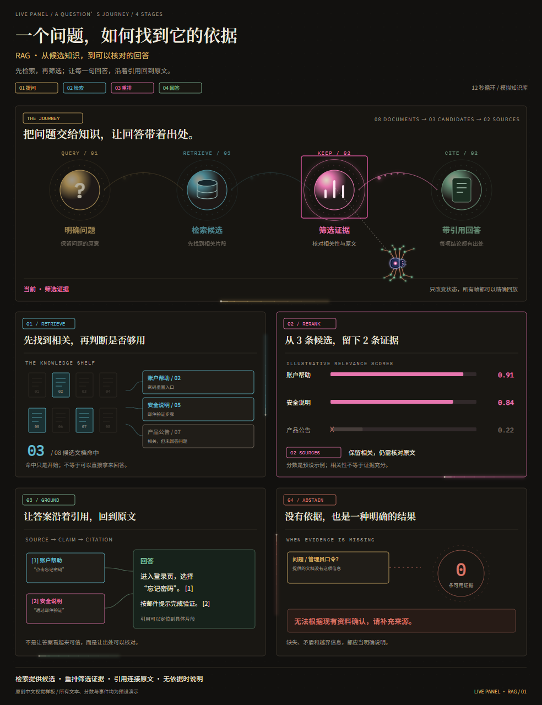
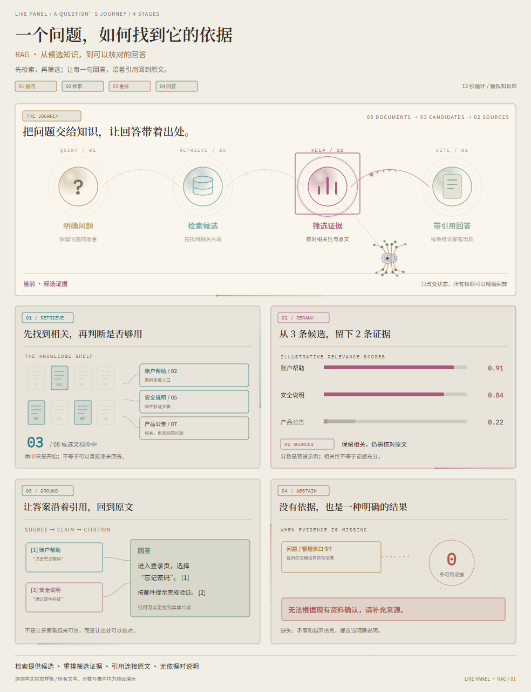

# Live Panel Studio

把架构、流程与知识讲解做成可交互、可导出的视频面板。

**Live Panel Studio turns JSON configurations into animated diagrams, interactive web pages and MP4 videos.** Built on [live-panel-skill](https://github.com/ythx-101/live-panel-skill), with eight Chinese demos, dark/light themes, animated avatars and individual block exports.

维护与交流：**[@sycbruce · X](https://x.com/sycbruce)** · [提交问题](https://github.com/cwybruce/live-panel-studio/issues)

| 暖黑主题 | 暖纸主题 |
| --- | --- |
|  |  |

## 能做什么

- **8 个原创中文 Demo**：RAG 证据讲解、多 Agent 交接、请求与缓存、知识卡、工单流转、故障恢复、矢量组件、角色导航。
- **深浅两套主题**：984 × 1280 竖屏排版，内嵌中文字体，每个功能块有流动的霓虹边缘、拖尾与局部泛光。
- **交互播放**：暂停、重播、时间轴拖动、关键时刻跳转、0.5 / 1 / 2 倍速；含角色的场景支持蜘蛛与机器人切换。
- **独立 MP4 导出**：每个 Demo 可整段导出，也可单独导出内部功能块，共 **39 个命名区域**。导出按当前主题、角色与范围生成新文件。
- **确定性回放**：动画由 `window.seek(t)` 驱动，浏览器预览和逐帧渲染使用同一时间线。
- **可修改的 JSON 和 SVG**：配置文本、数据、配色与时间线，扩展组件或重新设计场景。

Demo 中的事件、指标、日志和数据均为**预设模拟**，没有连接真实 Agent、数据库或业务服务。默认成片为 **12 秒、30 fps、H.264 MP4，附带静音 AAC 音轨**。

## 快速开始

当前实测环境为 **Windows、Python 3.11、系统 Chrome 与 FFmpeg**，渲染器也支持检测已安装的 Edge。推荐 Python 3.11 或更新版本。原上游保留 Linux / macOS 渲染路径；本项目新增的完整导出流程尚未在这些平台实测。

先安装：

1. [Python](https://www.python.org/downloads/) 3.11+。
2. [Chrome](https://www.google.com/chrome/) 或 [Edge](https://www.microsoft.com/edge)。使用系统浏览器，无需下载 Playwright Chromium。
3. [FFmpeg](https://ffmpeg.org/download.html)，将包含 `ffmpeg` 与 `ffprobe` 的目录加入 `PATH`。

在终端运行：

```powershell
git clone https://github.com/cwybruce/live-panel-studio.git
cd live-panel-studio
python -m pip install -r requirements-windows.txt
python scripts/make_capability_demos.py
python scripts/preview_server.py --port 8779
```

打开 **[http://127.0.0.1:8779/index.html](http://127.0.0.1:8779/index.html)**，选择 Demo、主题、角色和导出范围，再点击“导出当前方案”。服务只监听本机，生成的文件保存在 `examples/capability-demos/exports/`。

已生成的独立 HTML 可离线打开，也可部署到静态网站。**从 HTML 文件或静态托管网站浏览时，交互动画可用；生成新的 MP4 需要运行上面的本地 Python 预览服务。** 预生成的视频可直接下载。

## 示例与导出

| Demo | 场景 |
| --- | --- |
| [RAG 证据讲解](examples/capability-demos/rag-explainer/README.md) | 检索、评分、重排、引用与回答流向 |
| [多 Agent 任务交接](examples/capability-demos/agent-team/README.md) | 任务树、时间泳道、交接包与状态切换 |
| [请求与缓存分支](examples/capability-demos/product-request/README.md) | 请求路径、缓存命中、回源与合流 |
| [短视频知识卡](examples/capability-demos/knowledge-card/README.md) | 章节轮播、出处核对与回顾图谱 |
| [业务工单流转](examples/capability-demos/business-workflow/README.md) | 四站看板、问题分流、复核与重试 |
| [故障与恢复回放](examples/capability-demos/incident-replay/README.md) | 余量曲线、阈值、异常路径与恢复检查 |
| [矢量组件实验室](examples/capability-demos/component-lab/README.md) | 光球、座位、圆环、流带、看板与人物组件 |
| [角色导航与主题](examples/capability-demos/avatar-themes/README.md) | 蜘蛛 / 机器人、路径移动、目标框与关键词提示 |

每个目录包含配置 JSON、独立 HTML、深浅主题 MP4、预览图和说明。完整体验说明见 [能力体验馆](examples/capability-demos/README.md)。

重新生成全部深浅主题视频：

```powershell
python scripts/make_capability_demos.py --render --themes both --jobs 2
```

命令行也可独立导出一个 Demo 或其中一个功能块：

```powershell
# 整段：RAG、浅色主题、机器人
python scripts/export_demo.py --scene rag-explainer --theme light-pastel --avatar drone --view full --out examples/capability-demos/exports/rag-light.mp4

# 功能块：只导出 RAG 的重排区域
python scripts/export_demo.py --scene rag-explainer --theme light-pastel --avatar drone --view rag-rerank --out examples/capability-demos/exports/rag-rerank-light.mp4
```

功能块按实际画布裁剪，保留内部动画、文字和边缘泛光；可用的场景及区域 ID 记录在 [`manifest.json`](examples/capability-demos/manifest.json) 中。原有配置与成片不会被当前方案导出覆盖。

## 做自己的场景

复制一份示例配置，修改文本、数据、颜色与布局，再导出：

```powershell
python scripts/render.py --config my-config.json --out my-video.mp4 --html-out my-page.html
python scripts/check_frames.py --config my-config.json --out-dir my-frames --repeat
```

- [`references/config-schema.md`](references/config-schema.md)：元素、状态机、主题、角色与 `effects.neon` 参数。
- [`references/motion-grammar.md`](references/motion-grammar.md)：路径光点、状态变化和时间线动法。
- `scripts/rag_editorial.py`、`editorial_systems.py`、`editorial_stories.py`、`editorial_components.py`：八个 Demo 的配置与叙事数据。
- `assets/*editorial*.js`、`components.js`、`neon-flow.js`：SVG 绘制、组件、角色与流光。
- [`SKILL.md`](SKILL.md)：供编码 Agent 使用的原上游工作流。

如果直接编辑生成后的 JSON，用 `render.py` 导出；再次运行 `make_capability_demos.py` 会按生成器内容重建配置。坐标以画布像素计，改比例需要重新排版；`render.py --width / --height` 只缩放输出。

中文字体子集已内嵌，现有场景无需联网或安装字体。新增汉字后如需保持跨设备一致的排版，应重新构建子集，方法与原始字体来源见 [`assets/fonts/README.md`](assets/fonts/README.md)。

## 验证

```powershell
python -m unittest discover -s tests -v
python scripts/verify_capability_demos.py
python scripts/verify_demo_exports.py
```

浏览器和导出检查需要系统浏览器、FFmpeg 与 `ffprobe`；完整检查会渲染 / 解码视频，在体验馆目录生成 `verification.json` 和 `export-verification.json`。这些本机报告不随源码发布；请以自己环境里的运行结果为准。

## 来源、许可与致谢

本项目基于 [ythx-101/live-panel-skill](https://github.com/ythx-101/live-panel-skill)，扩展起点为 [`8a70aa2`](https://github.com/ythx-101/live-panel-skill/commit/8a70aa2c4e3fac68b40e2472407e32e2637a7a36)。保留上游代码的 **MIT License** 和版权声明；在此基础上新增能力体验馆、原创中文场景、SVG 组件、角色、深浅主题和本地功能块导出。

上游的灵感及保留示例各有来源：

- [@thedelost](https://x.com/thedelost) 的 [Codex Agent 架构动态图](https://x.com/thedelost/status/2105398038026195279)，由 [@slashui](https://x.com/slashui/status/2105850132365443528) 引用传播；`examples/codex-agents/` 是其画面复刻，设计归原作者。
- `examples/agent-architecture/` 重现小红书 **@林纾** 的《AI Agent 的完整架构》静态信息图，设计、措辞和配色归原作者。
- `examples/airbnb/` 使用 [Latent.Space 访谈](https://www.latent.space/p/airbnb) 中 Airbnb 管理者自述的数据；跳动的计数用于演示。
- Noto Serif SC、Noto Sans SC 与 IBM Plex Mono 字体采用 **SIL OFL 1.1**，随仓库保留许可与更名子集说明。

MIT 许可覆盖代码，不将上述第三方视觉设计、文字、数据或字体重新授权为 MIT。来源及许可边界详见 [`THIRD_PARTY_NOTICES.md`](THIRD_PARTY_NOTICES.md) 与 [`LICENSE`](LICENSE)。用户提供的参考原视频及本地商业信息图复刻不作为新增公开示例打包。

欢迎提交 Issue、改进场景或贡献组件。项目交流与联系方式：**[X / @sycbruce](https://x.com/sycbruce)**。
